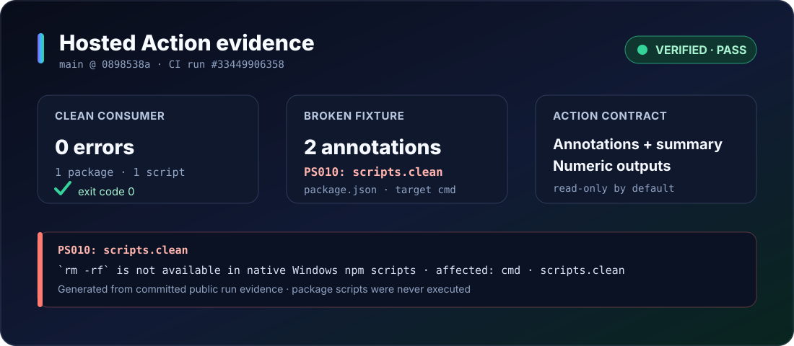

[English](README.md) | [简体中文](README.zh-CN.md)

<p align="center">
  <picture>
    <source media="(max-width: 700px)" srcset="docs/assets/brand/hero-mobile.svg">
    
  </picture>
</p>

<p align="center">
  <a href="https://github.com/Tom409114/scriptspect/actions/workflows/ci.yml"></a>
  <a href="LICENSE"></a>
</p>

<p align="center"><strong>Catch cross-platform package.json script bugs before CI or teammates do.</strong></p>

ScriptSpect is a preflight checker for npm-style `package.json` scripts. Point
it at a Node.js project or monorepo: without running the scripts, it shows the
command fragments that may break in `posix-sh`, Windows `cmd`, or optional
`powershell`, explains the affected platform, and offers a fix only when its
safety conditions are proved.

<!-- readme-state:overview:start -->
> [!TIP]
> Verified release: [`scriptspect@0.1.2`](https://www.npmjs.com/package/scriptspect/v/0.1.2). The immutable Action
> tag is [`v0.1.2`](https://github.com/Tom409114/scriptspect/releases/tag/v0.1.2); security-sensitive workflows can pin
> the full release commit `6f439bb974b297d5a334cebe989b4b50d7483677`.

**[Run in 30 seconds](#quick-start)** · **[See the real demo](#before-result-and-after)** · **[GitHub Actions](#github-actions)** · **[Rules](docs/rules/README.md)**
<!-- readme-state:overview:end -->

<!-- readme-state:evaluate:start -->
<!-- readme-section: evaluate -->
## Quick start

Requires Node.js 22 or newer. Run the exact [verified npm release](https://www.npmjs.com/package/scriptspect/v/0.1.2)
without a global install:

```bash
npx --yes scriptspect@0.1.2 .
```

With pnpm:

```bash
pnpm dlx scriptspect@0.1.2 .
```

Findings exit `1`; a clean scan exits `0`; invalid input, configuration, or I/O
exits `2`. Start with `--fix-dry-run` before applying any reviewed fix.
<!-- readme-state:evaluate:end -->

<!-- readme-section: purpose -->
## One project. Different machines. The same scripts.

**A build that works on your Mac can fail on a contributor's Windows laptop.**
ScriptSpect catches those shell assumptions in `package.json` before they reach CI.

| Your workflow | What ScriptSpect gives you |
| --- | --- |
| Maintain a JS/TS app, library, or CLI | Find the command and platform behind a portability failure. |
| Work in a monorepo | Check the root package and discovered workspaces together. |
| Review human- or agent-written scripts | Get structured JSON or PR annotations, then preview a fix with `--fix-dry-run`. |

**Point it at a repository → inspect the findings → review the patch.**
Analysis is local and read-only by default. You decide which fixes to apply.

<!-- readme-section: why -->
## Why it is useful

**The payoff: catch a shell mismatch while reviewing a change, instead of
waiting for a teammate's machine or an OS-specific CI job to fail.**
This is particularly useful for cross-platform teams, published developer tools,
and repositories where coding agents frequently change package scripts.

<!-- readme-section: demo -->
## Before, result, and after

### Example 1 · “It builds on my Mac. Why does Windows fail?”

You maintain a Vite project. A teammate—or a coding agent—adds the two scripts
below. On a Mac they use familiar shell syntax; native Windows npm scripts use
`cmd`, where inline environment assignments and `rm -rf` are incompatible.

**Try it yourself:** save this complete example as `package.json` in a new,
empty folder. Open a terminal there. For this scan-and-patch demo, you do not
need to install or execute the declared build tools.

**Before — two scripts that assume a POSIX shell:**

```json
{
  "name": "portable-demo",
  "private": true,
  "scripts": {
    "build": "NODE_ENV=production vite build",
    "clean": "rm -rf dist"
  },
  "devDependencies": {
    "cross-env": "^7.0.3",
    "rimraf": "^6.0.1",
    "vite": "^7.0.0"
  }
}
```

**1. Find the problem before running the build:**

```bash
npx --yes scriptspect@0.1.2 .
```

| Script | Finding | What it means for you |
| --- | --- | --- |
| `build` | `PS001` · `NODE_ENV=production` | Windows cmd does not use this environment-variable assignment syntax. |
| `clean` | `PS010` · `rm -rf dist` | Native Windows cmd does not provide this command. |

The actual scan reports **2 errors and 2 advisories**, with exit code `1`.
The advisories explain how the same build command is parsed differently.
The screenshot and patch below come from the executable
[demo fixture](tests/fixtures/readme-demo/package.json).


[Selectable terminal text](docs/assets/demo/terminal.txt) · [Full generated patch](docs/assets/demo/fix.patch) · [Verified after file](docs/assets/demo/package.after.json)

**2. Preview the proposed changes without modifying the file:**

```bash
npx --yes scriptspect@0.1.2 . --fix-dry-run
```

The important changes are shown below. These rewrites are available because
`cross-env` and `rimraf` are already declared in this example:

```diff
-"build": "NODE_ENV=production vite build"
-"clean": "rm -rf dist"
+"build": "cross-env NODE_ENV=production vite build"
+"clean": "rimraf dist"
```

**3. Apply the reviewed changes, then scan again:**

```bash
npx --yes scriptspect@0.1.2 . --fix
npx --yes scriptspect@0.1.2 .
```

Actual result with the published package:

```text
scriptspect: fixed 2 script(s) in package.json
Scanned 2 scripts across 1 package · 0 errors · 0 warnings
```

The final scan exits `0`, with no findings. The two demonstrated shell
incompatibilities have been removed before anyone runs the build.
Review fixes in your own project; the tool leaves dependency installation to you.

### Example 2 · Give your coding agent a concrete review result

After an agent edits `package.json`, run:

```bash
npx --yes scriptspect@0.1.2 . --format json
```

For the original example, a finding contains these fields (excerpt):

```json
{
  "ruleId": "PS001",
  "scriptName": "build",
  "packagePath": "package.json",
  "severity": "error",
  "affectedTargets": ["cmd"]
}
```

Paste the JSON output into your coding agent's conversation, or have the agent
run the command through its terminal tool. Ask it to propose a minimal patch
for the reported file, script and target. Review its patch and rerun the scan.
The same command discovers supported workspaces in a
monorepo, so each package's script can be identified separately.

### Example 3 · Catch the same mistake in a pull request

Add the [GitHub Actions workflow below](#github-actions). If a future PR adds
the incompatible clean script, the Action marks the check as failed and
annotates `package.json`; a clean fixture passes. See the real hosted result
below the workflow. Reviewers get the problem alongside the code change.

<!-- readme-section: cli -->
## CLI at a glance

The CLI supports human, JSON, and GitHub-friendly output, focused rule
runs, explicit target matrices, and opt-in fixes.

```bash
npx --yes scriptspect@0.1.2 .
npx --yes scriptspect@0.1.2 . --format json
npx --yes scriptspect@0.1.2 . --target posix-sh,cmd,powershell
npx --yes scriptspect@0.1.2 . --rule PS001,PS010
npx --yes scriptspect@0.1.2 . --fix-dry-run
npx --yes scriptspect@0.1.2 . --fix
npx --yes scriptspect@0.1.2 explain PS010
```

Presentation filters do not hide failure semantics: any configured `error`
fails, and the unfiltered warning count is compared with `--max-warnings`.

<!-- readme-state:action:start -->
<!-- readme-section: action -->
## GitHub Actions

Use the [verified immutable release tag](https://github.com/Tom409114/scriptspect/releases/tag/v0.1.2) for readable workflows.
For the strongest supply-chain pin, replace `v0.1.2` with the full release
commit `6f439bb974b297d5a334cebe989b4b50d7483677`.

```yaml
name: scriptspect
on: [pull_request]
permissions:
  contents: read
jobs:
  scripts:
    runs-on: ubuntu-latest
    steps:
      - uses: actions/checkout@3d3c42e5aac5ba805825da76410c181273ba90b1 # v7.0.1
        with:
          persist-credentials: false
      - uses: Tom409114/scriptspect@v0.1.2
        with:
          path: .
```

The Action writes annotations, a job summary, and numeric outputs named
`exit-code`, `packages`, `scripts`, `errors`, `warnings`, and `advisories` before
marking a finding run as failed. Its default mode is read-only.
<!-- readme-state:action:end -->

**Real hosted proof — not a mock screenshot.** On `main` at `c9c671c8`, public
[CI run #33482453059](https://github.com/Tom409114/scriptspect/actions/runs/33482453059)
consumed `uses: ./` against both clean and broken fixtures. The clean consumer
reported `1 package · 1 script · 0 errors`; the broken fixture emitted 2 check
annotations, including `PS010: scripts.clean` on `package.json`.



[Selectable Action evidence](docs/assets/demo/action.txt) · [Committed source evidence](docs/validation/readme-action-evidence.json) · [Open the hosted job](https://github.com/Tom409114/scriptspect/actions/runs/33482453059/job/99774890433)

<!-- readme-section: config -->
## Minimal configuration

Defaults target `posix-sh` and `cmd`. Put the same small contract in the root
`package.json` under `scriptspect`, or in `scriptspect.config.json`:

```json
{
  "targets": ["posix-sh", "cmd"],
  "severity": { "PS015": "advisory" },
  "ignore": [
    { "packages": ["examples/**"], "rules": ["PS030"] },
    { "scripts": ["docs:unix"], "rules": ["PS010", "PS011"] }
  ]
}
```

Precedence is deterministic and replacement-based:
`--config` → `package.json#scriptspect` → `scriptspect.config.json` → defaults.
`--target` then replaces only the selected config's target list. Config sources
are never merged. Ignore entries must name rules and should stay narrow enough
to explain an intentional platform-specific script.

Contracts: [config JSON Schema](schema/config.schema.json) · [JSON output Schema](schema/output.schema.json)

<!-- readme-section: support -->
## Built for your workflow

<!-- readme-state:scope-table:start -->
| Area | Current behavior |
| --- | --- |
| Projects | root `package.json` plus npm/Yarn/Bun workspaces and `pnpm-workspace.yaml` |
| Targets | `posix-sh` + `cmd` by default; opt-in `powershell` evidence |
| Findings | error, warning, and advisory with high/medium confidence |
| Output | stylish terminal text, versioned JSON, GitHub annotations + summary |
| Fixes | dry-run plus provable safe/conditional rewrites; ambiguous cases stay manual |
| Privacy | offline analysis; scripts are not executed; no telemetry |
<!-- readme-state:scope-table:end -->
<!-- readme-state:release-row:start -->
**Release:** [npm 0.1.2](https://www.npmjs.com/package/scriptspect/v/0.1.2) · [Action v0.1.2](https://github.com/Tom409114/scriptspect/releases/tag/v0.1.2) · full SHA `6f439bb974b297d5a334cebe989b4b50d7483677`.
<!-- readme-state:release-row:end -->

Have a real cross-platform failure? [Open an issue](https://github.com/Tom409114/scriptspect/issues/new/choose) with the script, target shell, and expected behavior. Your example helps improve the rules.

<!-- readme-section: faq -->
## FAQ and troubleshooting

**Does it run my scripts?** No. It reads package manifests and performs static
structural analysis.

**Why did the scan exit `1` when I filtered warnings from the display?** Failure
is calculated before presentation filtering: configured errors and the full
warning budget still count. Use `--format json` to inspect the complete contract.

**Why was no automatic fix offered?** The parser must agree on the replacement's
structural role across active targets, and conditional fixes require the exact
dependency to be declared. Otherwise the finding remains explanatory and manual.

**Which config won?** Explicit `--config` wins, followed by the `package.json`
field, the standalone file, then defaults. Non-default sources are reported in
human-readable output.

<!-- readme-state:production-faq:start -->
**Can I use it in production CI today?** Yes—use the verified `scriptspect@0.1.2`
package or immutable `v0.1.2` Action reference above. Pin `6f439bb974b297d5a334cebe989b4b50d7483677`
when your policy requires an exact commit.
<!-- readme-state:production-faq:end -->

<!-- readme-section: navigation -->
## Go deeper

- [Documentation index](docs/README.md)
- [All rules](docs/rules/README.md)
- [Architecture and parser contract](docs/architecture.md)
- [Comparison boundary](docs/comparison.md)
- [Compliance audit](docs/validation/spec-compliance-2026-09-01.md)
- [Corpus methodology](docs/evidence/corpus-method.md)
- [Security policy](SECURITY.md)
- [Contributing](CONTRIBUTING.md)
- [Share ScriptSpect: launch drafts and demo storyboard](docs/launch-kit.md)
- [Roadmap](docs/roadmap.md)
- [Evidence policy](docs/evidence/README.md)

<!-- readme-section: license -->
## License

[MIT](LICENSE)
