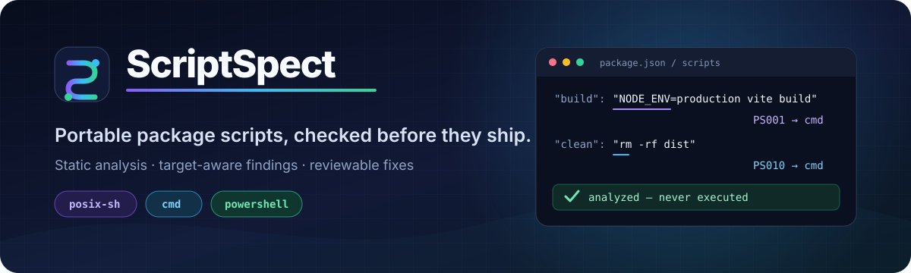
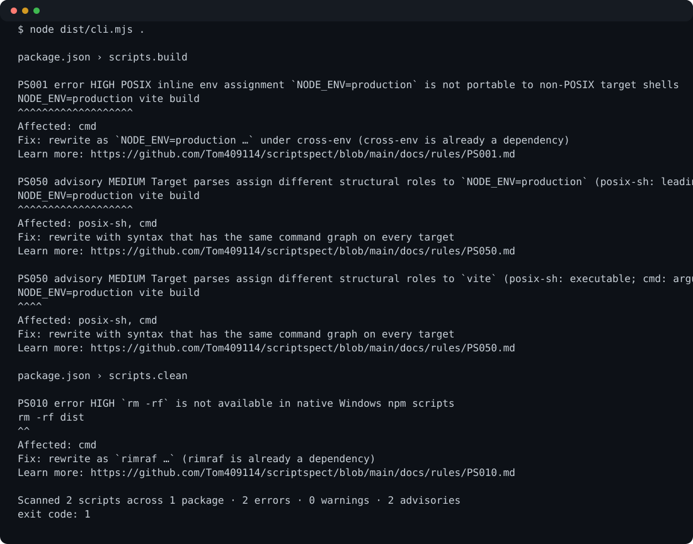

[English](README.md) | [简体中文](README.zh-CN.md)

<p align="center">
  
</p>

<p align="center">
  <a href="https://github.com/Tom409114/scriptspect/actions/workflows/ci.yml"></a>
  <a href="LICENSE"></a>
</p>

<p align="center"><strong>同一条脚本，多种 shell 解释；每条 finding 都明确指出真正会出错的 target。</strong></p>

ScriptSpect 会静态检查 npm 风格的 `package.json` scripts，并且不会运行它们。它识别在 `posix-sh`、Windows `cmd` 或可选 `powershell` 下含义不同的结构，精确指向相关 span，并只在安全条件得到证明后提供自动修复。

> [!IMPORTANT]
> 本仓库目前是**预发布源码评估版**。npm package 与公开 Action tag 尚不存在；下面所有可复制步骤都特意固定到不可变 source commit。

**[查看真实 demo](#修复前分析结果与修复后)** · **[从源码评估](#从源码评估evaluate-from-source-pre-release)** · **[GitHub Actions](#github-actions-预览pre-release)** · **[规则列表](docs/rules/README.md)**

<!-- readme-section: why -->
## 为什么值得使用

| 提前发现跨平台故障 | 解释具体 target | 让修复可审查 |
| --- | --- | --- |
| 在另一种操作系统真正执行前，找出依赖特定 shell 的命令、operator、expansion、redirection、path 与未声明 executable。 | 每条 finding 都带有稳定 rule ID、package/script path、source span、severity、confidence 与受影响 targets。 | `safe`、`conditional`、`manual` 三类安全级别，避免在无法证明等价时进行“热心”改写。 |

ScriptSpect 使用 target-specific 的结构化 parser，而不是用一组正则表达式扫描 quoted text。它有意不做完整 shell interpreter；finding 仍应由拥有该 script 的项目审查。

<!-- readme-section: evaluate -->
## 从源码评估（Evaluate from source (pre-release)）

需要 Node.js 22 或更高版本，并通过 Corepack 使用 pnpm。克隆仓库、检出经审阅的 commit、严格按 lockfile 安装、构建，再扫描版本化 demo fixture。存在 finding 时退出 `1`；clean scan 退出 `0`；无效输入、配置或 I/O 退出 `2`。

```bash
git clone https://github.com/Tom409114/scriptspect.git
cd scriptspect
git checkout 13dfcfcec3f50c3dd786a1f9b2a4225391ded0e5
corepack enable
pnpm install --frozen-lockfile
pnpm build
node dist/cli.mjs tests/fixtures/readme-demo
```

这里特意还没有 `npx scriptspect` 快速开始。机器可读的 release state 见 [docs/readme-status.json](docs/readme-status.json)。

<!-- readme-section: demo -->
## 修复前、分析结果与修复后

这里的全部内容都由版本化 [demo fixture](tests/fixtures/readme-demo/package.json) 生成，因此 screenshot 与 patch 不会偏离可执行行为。

**修复前——两条假定 POSIX shell 的 scripts：**

```json
{
  "name": "portable-demo",
  "private": true,
  "scripts": {
    "build": "NODE_ENV=production vite build",
    "clean": "rm -rf dist"
  },
  "devDependencies": {
    "cross-env": "^7.0.3",
    "rimraf": "^6.0.1",
    "vite": "^7.0.0"
  }
}
```

**分析结果——`PS001` 与 `PS010` 精确指出不兼容 cmd 的 span：**



[可选择的终端文本](docs/assets/demo/terminal.txt) · [完整生成 patch](docs/assets/demo/fix.patch) · [验证后的文件](docs/assets/demo/package.after.json)

**修复后——conditional rewrites 使用项目已经声明的 dependencies：**

```diff
-"build": "NODE_ENV=production vite build"
-"clean": "rm -rf dist"
+"build": "cross-env NODE_ENV=production vite build"
+"clean": "rimraf dist"
```

`--fix-dry-run` 只打印 patch 而不写入。`--fix` 使用 staged writes、写后重新分析与 recovery journal；它不会安装依赖或改写 lockfile。使用 `pnpm exec tsx tools/generate-readme-demo.ts` 可重新生成全部 demo assets。

<!-- readme-section: cli -->
## CLI 快速参考

源码 build 支持面向人的输出、JSON、GitHub annotations、聚焦 rule、显式 target matrix 与选择性修复。

```bash
node dist/cli.mjs [path]
node dist/cli.mjs [path] --format json
node dist/cli.mjs [path] --target posix-sh,cmd,powershell
node dist/cli.mjs [path] --rule PS001,PS010
node dist/cli.mjs [path] --fix-dry-run
node dist/cli.mjs [path] --fix
node dist/cli.mjs explain PS010
```

显示过滤不会隐藏失败语义：任何配置为 `error` 的 finding 都会失败；未过滤 warning 总数会与 `--max-warnings` 比较。

<!-- readme-section: action -->
## GitHub Actions 预览（pre-release）

这个完整示例会同时检出 consumer 与不可变 ScriptSpect source commit，然后运行 bundled local Action。不要把 commit 替换为尚不存在的 `Tom409114/scriptspect@v0.1` tag。正式 release 得到验证后，安全敏感 workflow 仍应固定到完整 commit SHA。

```yaml
name: scriptspect pre-release evaluation
on: [pull_request]
permissions:
  contents: read
jobs:
  scripts:
    runs-on: ubuntu-latest
    steps:
      - uses: actions/checkout@3d3c42e5aac5ba805825da76410c181273ba90b1 # v7.0.1
        with:
          persist-credentials: false
      - uses: actions/checkout@3d3c42e5aac5ba805825da76410c181273ba90b1 # v7.0.1
        with:
          repository: Tom409114/scriptspect
          ref: 13dfcfcec3f50c3dd786a1f9b2a4225391ded0e5
          path: .scriptspect
          persist-credentials: false
      - uses: ./.scriptspect
        with:
          path: .
```

Action 会先写入 annotations、job summary 以及名为 `exit-code`、`packages`、`scripts`、`errors`、`warnings`、`advisories` 的数字 outputs，再把 finding run 标记为失败。默认模式只读。

<!-- readme-section: config -->
## 最小配置

默认 targets 为 `posix-sh` 与 `cmd`。可以把同一份小型 contract 放在根 `package.json` 的 `scriptspect` 字段，或放入 `scriptspect.config.json`：

```json
{
  "targets": ["posix-sh", "cmd"],
  "severity": { "PS015": "advisory" },
  "ignore": [
    { "packages": ["examples/**"], "rules": ["PS030"] },
    { "scripts": ["docs:unix"], "rules": ["PS010", "PS011"] }
  ]
}
```

优先级确定且采用整体替换：`--config` → `package.json#scriptspect` → `scriptspect.config.json` → defaults。之后，`--target` 只替换已选配置中的 target list。不同 config source 绝不会 merge。Ignore entry 必须指定 rules，并应足够精确地解释有意的平台专用 script。

Contracts：[config JSON Schema](schema/config.schema.json) · [JSON output Schema](schema/output.schema.json)

<!-- readme-section: support -->
## 支持范围与诚实边界

| 范围 | 当前源码评估行为 |
| --- | --- |
| Projects | 根 `package.json`，以及 npm/Yarn/Bun workspaces 与 `pnpm-workspace.yaml` |
| Targets | 默认 `posix-sh` + `cmd`；可选 `powershell` evidence |
| Findings | error、warning、advisory，并带 high/medium confidence |
| Output | stylish terminal text、versioned JSON、GitHub annotations + summary |
| Fixes | dry-run 以及可证明的 safe/conditional rewrites；ambiguous case 保持 manual |
| Privacy | 离线分析；不执行 scripts；无 telemetry |
| Release | pre-release；目前没有 npm package 或公开 Action reference |

本主页不宣称外部采用、测量精度、比较优势、hosted performance 或 release gate 已完成。[validation ledger](docs/validation/spec-compliance-2026-09-01.md) 会把仓库内可以完成的工程工作，与只有真实用户和公开 release 才能形成的 evidence 分开。

<!-- readme-section: faq -->
## 常见问题与故障排查

**它会运行我的 scripts 吗？** 不会。它只读取 package manifests 并执行静态结构分析。

**为什么显示过滤掉 warning 后仍退出 `1`？** 失败会在 presentation filter 之前计算：配置为 error 的 finding 与完整 warning budget 仍然生效。使用 `--format json` 查看完整 contract。

**为什么没有 automatic fix？** Parser 必须在 active targets 间对 replacement 的结构角色达成一致，而且 conditional fix 要求精确 dependency 已声明；否则 finding 只解释问题并保持 manual。

**最终使用了哪个 config？** 显式 `--config` 优先，其次是 `package.json` 字段、standalone file，最后是 defaults。人类可读输出会报告非默认 source。

**现在能在 production CI 使用吗？** 请把这份 source checkout 当作 evaluation build。等待公开 npm、Release、provenance、checksum 与 immutable Action-consumer evidence 齐全后，再依赖 released reference。

<!-- readme-section: navigation -->
## 深入了解

以下均为 English documentation：

- [Documentation index](docs/README.md)
- [All rules](docs/rules/README.md)
- [Architecture and parser contract](docs/architecture.md)
- [Comparison boundary](docs/comparison.md)
- [Compliance audit](docs/validation/spec-compliance-2026-09-01.md)
- [Corpus methodology](docs/evidence/corpus-method.md)
- [Security policy](SECURITY.md)
- [Contributing](CONTRIBUTING.md)
- [Roadmap](docs/roadmap.md)
- [Evidence policy](docs/evidence/README.md)

<!-- readme-section: license -->
## 许可证

[MIT](LICENSE)
